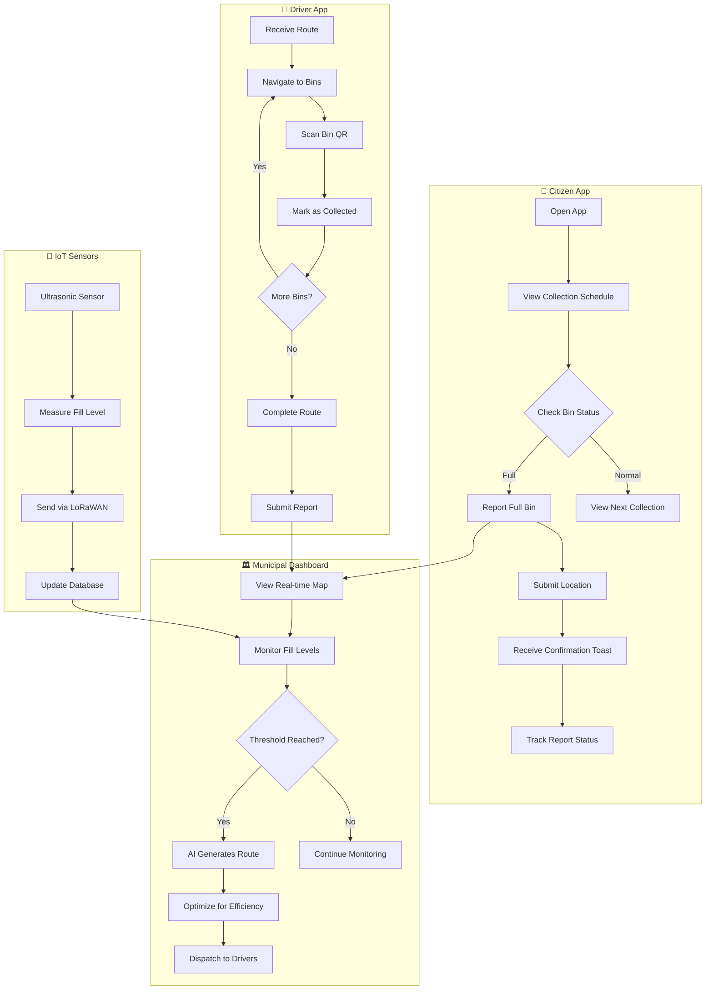

# 2.1 Waste Route Optimization - Workflow Diagram

## Service Description
AI-powered route optimization for waste collection vehicles with IoT fill-level sensors.

## User Flow Diagram



## Screens Required

| Screen | Description | Status |
|--------|-------------|--------|
| Collection Schedule | View weekly pickup times | ✅ Implemented |
| Bin Status Map | Real-time fill levels | ⚠️ Admin Only |
| Report Full Bin | Submit overflow report | ✅ Via Requests |
| Report Tracking | Track submitted reports | ✅ Implemented |

## API Endpoints

```
GET  /api/waste/schedule?zone={zoneId}
GET  /api/waste/bins?lat={lat}&lng={lng}&radius={m}
POST /api/waste/reports
GET  /api/waste/reports/{id}/status
GET  /api/waste/routes/optimized
POST /api/waste/collection/complete
```

## Notifications

| Event | Channel | Message |
|-------|---------|---------|
| Collection Tomorrow | Push | "Waste collection scheduled for tomorrow at 7:00 AM" |
| Bin Collected | Push | "Your reported bin has been collected" |
| Schedule Change | Push/SMS | "Collection schedule changed due to holiday" |
