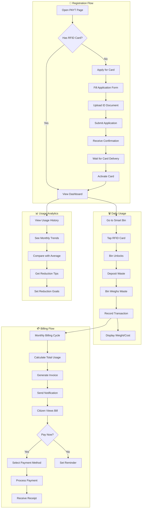

# 2.2 Pay-As-You-Throw (PAYT) - Workflow Diagram

## Service Description

Volume/weight-based waste billing system with RFID identification and citizen portal.

## User Flow Diagram



## Screens Required

| Screen | Description | Status |
|--------|-------------|--------|
| PAYT Dashboard | Overview with usage stats | ✅ Implemented |
| Card Registration | Apply for RFID card | ✅ Implemented |
| Usage History | Monthly/weekly breakdown | ✅ Implemented |
| Billing | View and pay invoices | ✅ Implemented |
| Analytics | Usage trends and tips | ✅ Implemented |
| Card Activation | Activate new card | ✅ Implemented |

## API Endpoints

```text
POST /api/payt/register
GET  /api/payt/card/{cardId}/status
POST /api/payt/card/{cardId}/activate
GET  /api/payt/usage?from={date}&to={date}
GET  /api/payt/billing/current
GET  /api/payt/billing/history
POST /api/payt/billing/{invoiceId}/pay
GET  /api/payt/analytics/trends
```

## Notifications

| Event | Channel | Message |
|-------|---------|---------|
| Card Ready | Push/SMS | "Your PAYT card is ready for pickup" |
| Monthly Bill | Push/Email | "Your PAYT bill for November: €12.50" |
| Payment Due | Push/SMS | "Payment due in 3 days" |
| Payment Received | Push | "Payment of €12.50 received. Thank you!" |
| Usage Alert | Push | "You've used 80% of your monthly average" |
