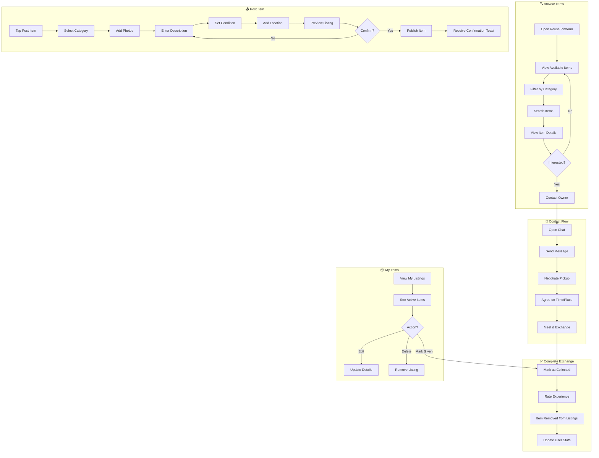

# 2.3 Exchange & Reuse Platform - Workflow Diagram

## Service Description

Citizen-to-citizen platform for exchanging reusable items, reducing landfill waste.

## User Flow Diagram



## Screens Required

| Screen | Description | Status |
|--------|-------------|--------|
| Browse Items | Grid of available items | ✅ Implemented |
| Item Details | Full item info + contact | ✅ Implemented |
| Post Item | Multi-step posting form | ✅ Implemented |
| Chat | In-app messaging | ✅ Implemented |
| My Listings | Manage posted items | ✅ Implemented |
| User Profile | Stats and ratings | ⚠️ Basic |

## API Endpoints

```text
GET  /api/reuse/items?category={cat}&search={q}
GET  /api/reuse/items/{id}
POST /api/reuse/items
PUT  /api/reuse/items/{id}
DELETE /api/reuse/items/{id}
POST /api/reuse/items/{id}/interest
GET  /api/reuse/conversations
POST /api/reuse/conversations/{id}/messages
POST /api/reuse/items/{id}/complete
POST /api/reuse/items/{id}/rate
```

## Notifications

| Event | Channel | Message |
|-------|---------|---------|
| New Interest | Push | "Someone is interested in your Sofa" |
| New Message | Push | "New message from Maria about Sofa" |
| Item Collected | Push | "Great! Your item found a new home 🎉" |
| Similar Item | Push | "New item matching your search: Desk" |
