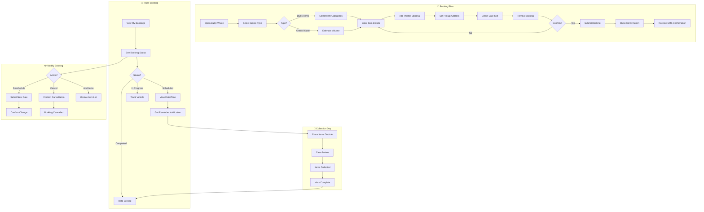

# 2.4 Bulky/Green Waste Booking - Workflow Diagram

## Service Description

Online booking system for collection of large items and garden waste.

## User Flow Diagram



## Screens Required

| Screen | Description | Status |
|--------|-------------|--------|
| Waste Type Selection | Choose bulky/green | ✅ Implemented |
| Item Selection | Multi-select categories | ✅ Implemented |
| Photo Upload | Optional item photos | ✅ Implemented |
| Address Entry | Pickup location | ✅ Implemented |
| Date Selection | Available time slots | ✅ Implemented |
| Booking Confirmation | Summary + reference | ✅ Implemented |
| My Bookings | List of bookings | ✅ Implemented |
| Booking Details | Full booking info | ✅ Implemented |
| Track Collection | Real-time tracking | ⚠️ Mock Data |

## API Endpoints

```text
GET  /api/bulky/categories
GET  /api/bulky/slots?date={date}&zone={zone}
POST /api/bulky/bookings
GET  /api/bulky/bookings
GET  /api/bulky/bookings/{id}
PUT  /api/bulky/bookings/{id}
DELETE /api/bulky/bookings/{id}
GET  /api/bulky/bookings/{id}/track
POST /api/bulky/bookings/{id}/rate
```

## Notifications

| Event | Channel | Message |
|-------|---------|---------|
| Booking Confirmed | Push/SMS | "Bulky waste pickup confirmed for Dec 15, 8-12" |
| Reminder | Push | "Reminder: Place items outside by 8 AM tomorrow" |
| Crew En Route | Push | "Collection crew is on the way (ETA 30 min)" |
| Collection Complete | Push | "Your items have been collected. Thank you!" |
| Booking Modified | SMS | "Your booking has been rescheduled to Dec 18" |
