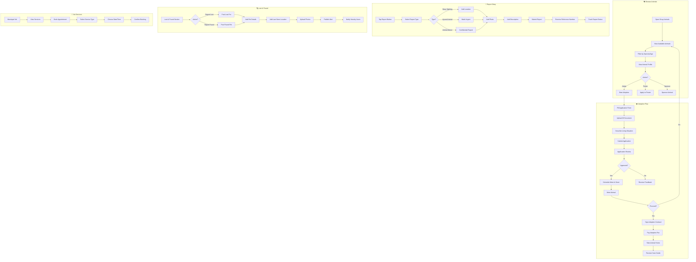

# 2.5 Stray Animal Management - Workflow Diagram

## Service Description

Comprehensive stray animal registry with adoption, reporting, and vet services.

## User Flow Diagram



## Screens Required

| Screen | Description | Status |
|--------|-------------|--------|
| Animal List | Browse adoptable animals | ✅ Implemented |
| Animal Profile | Detailed animal info | ✅ Implemented |
| Adoption Form | Multi-step application | ✅ Implemented |
| Report Stray | Location + photo report | ✅ Implemented |
| Lost & Found | Post/browse lost pets | ⚠️ Basic |
| Vet Booking | Schedule vet visit | ⚠️ Basic |
| My Applications | Track adoption status | ✅ Implemented |

## API Endpoints

```text
GET  /api/animals?species={s}&status={status}
GET  /api/animals/{id}
POST /api/animals/adoption/apply
GET  /api/animals/adoption/applications
POST /api/animals/reports
GET  /api/animals/reports/{id}
POST /api/animals/lost-found
GET  /api/animals/lost-found?type={lost|found}
POST /api/animals/vet/appointments
GET  /api/animals/vet/services
```

## Notifications

| Event | Channel | Message |
|-------|---------|---------|
| Application Received | Push | "Your adoption application has been received" |
| Application Approved | Push/SMS | "Great news! Your application for Max is approved" |
| Meet & Greet Scheduled | Push | "Meet & Greet scheduled for Dec 10 at 2 PM" |
| Report Update | Push | "Update on your report: Animal has been rescued" |
| Lost Pet Match | Push | "A found pet matching your description was reported" |
| Vet Reminder | Push | "Reminder: Vet appointment tomorrow at 10 AM" |
