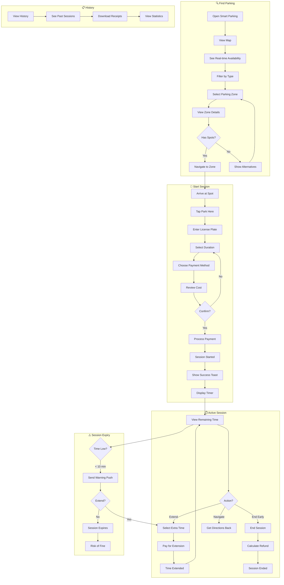

# 2.6 Smart Parking - Workflow Diagram

## Service Description

Real-time parking availability with mobile payment and session management.

## User Flow Diagram



## Screens Required

| Screen | Description | Status |
|--------|-------------|--------|
| Parking Map | Real-time availability | ✅ Implemented |
| Zone Details | Spots, price, features | ✅ Implemented |
| Start Session | License + duration | ✅ Implemented |
| Payment | Card selection + confirm | ✅ Implemented |
| Active Session | Timer + actions | ✅ Implemented |
| Extend Time | Add more time | ✅ Implemented |
| Session History | Past sessions | ⚠️ Basic |
| Navigation | Directions to spot | ✅ Via External |

## API Endpoints

```text
GET  /api/parking/zones?lat={lat}&lng={lng}&radius={m}
GET  /api/parking/zones/{id}
GET  /api/parking/zones/{id}/availability
POST /api/parking/sessions
GET  /api/parking/sessions/active
PUT  /api/parking/sessions/{id}/extend
DELETE /api/parking/sessions/{id}
GET  /api/parking/sessions/history
GET  /api/parking/sessions/{id}/receipt
```

## Notifications

| Event | Channel | Message |
|-------|---------|---------|
| Session Started | Push | "Parking session started. Expires at 14:30" |
| 10 Min Warning | Push | "Your parking expires in 10 minutes" |
| 5 Min Warning | Push | "⚠️ 5 minutes left! Extend now to avoid a fine" |
| Session Expired | Push | "Your parking session has expired" |
| Session Extended | Push | "Session extended until 16:00" |
| Payment Receipt | Email | "Receipt for parking session €3.00" |
