# 2.7 Citizen Request System - Workflow Diagram

## Service Description

Unified platform for submitting and tracking municipal service requests.

## User Flow Diagram

```mermaid
flowchart TD
    subgraph Submit["📝 Submit Request"]
        A[Open Requests] --> B[Tap New Request]
        B --> C[Select Category]
        C --> D{Category Type}
        D -->|Infrastructure| E[Pothole/Lighting/etc]
        D -->|Cleanliness| F[Garbage/Graffiti/etc]
        D -->|Safety| G[Hazard/Vandalism/etc]
        D -->|Other| H[General Request]
        E --> I[Add Location]
        F --> I
        G --> I
        H --> I
        I --> J[Use GPS or Pick on Map]
        J --> K[Add Description]
        K --> L[Attach Photos]
        L --> M[Set Priority]
        M --> N[Review Request]
        N --> O{Submit?}
        O -->|Yes| P[Submit Request]
        P --> Q[Show Success Toast]
        Q --> R[Display Reference Number]
        O -->|No| K
    end

    subgraph Track["📍 Track Request"]
        S[View My Requests] --> T[See Request List]
        T --> U[Select Request]
        U --> V[View Status Timeline]
        V --> W{Current Status}
        W -->|Submitted| X[Awaiting Assignment]
        W -->|Assigned| Y[View Assigned Team]
        W -->|In Progress| Z[See Work Updates]
        W -->|Resolved| AA[View Resolution]
        AA --> AB[Rate Service]
        AB --> AC[Provide Feedback]
    end

    subgraph Updates["🔔 Updates Flow"]
        AD[Status Change] --> AE[Send Push Notification]
        AE --> AF[Update Timeline]
        AF --> AG{Needs Action?}
        AG -->|Yes| AH[Request More Info]
        AH --> AI[Citizen Responds]
        AI --> AF
        AG -->|No| AJ[Continue Processing]
    end

    subgraph Admin["🏛️ Admin Processing"]
        AK[Request Received] --> AL[Auto-categorize with AI]
        AL --> AM[Assign to Department]
        AM --> AN[Assign to Team]
        AN --> AO[Team Investigates]
        AO --> AP[Update Status]
        AP --> AQ[Resolve Issue]
        AQ --> AR[Close Request]
        AR --> AD
    end
```



## Screens Required

| Screen | Description | Status |
|--------|-------------|--------|
| Request List | All user requests | ✅ Implemented |
| New Request | Category selection | ✅ Implemented |
| Location Picker | Map-based selection | ✅ Implemented |
| Request Form | Details + photos | ✅ Implemented |
| Request Details | Full info + timeline | ✅ Implemented |
| Status Timeline | Visual progress | ✅ Implemented |
| Feedback Form | Rate + comment | ✅ Implemented |

## API Endpoints

```text
GET  /api/requests/categories
POST /api/requests
GET  /api/requests
GET  /api/requests/{id}
GET  /api/requests/{id}/timeline
POST /api/requests/{id}/comments
POST /api/requests/{id}/attachments
POST /api/requests/{id}/feedback
GET  /api/requests/statistics
```

## Notifications

| Event | Channel | Message |
|-------|---------|---------|
| Request Submitted | Push | "Request #REQ-2024-001 submitted successfully" |
| Request Assigned | Push | "Your request has been assigned to Roads Dept" |
| Status Update | Push | "Update: Work scheduled for Dec 15" |
| Info Requested | Push | "We need more information about your request" |
| Request Resolved | Push | "Your request has been resolved. Please rate!" |
| Feedback Thanks | Push | "Thank you for your feedback!" |
