# 2.8 Municipal Transportation - Workflow Diagram

## Service Description

Real-time bus tracking, route planning, and arrival predictions.

## User Flow Diagram

```mermaid
flowchart TD
    subgraph Nearby["📍 Nearby Stops"]
        A[Open Bus Tracker] --> B[Detect Location]
        B --> C[Show Nearby Stops]
        C --> D[Select Stop]
        D --> E[View Arrivals]
        E --> F[See Real-time ETAs]
        F --> G{Bus Arriving?}
        G -->|< 3 min| H[Highlight Green]
        G -->|3-10 min| I[Show Normal]
        G -->|> 10 min| J[Show Schedule]
    end

    subgraph Routes["🚌 Route Info"]
        K[View Routes Tab] --> L[See All Routes]
        L --> M[Select Route]
        M --> N[View Route Map]
        N --> O[See All Stops]
        O --> P[View Schedule]
        P --> Q[Check Frequency]
    end

    subgraph Favorites["⭐ Favorites"]
        D --> R[Add to Favorites]
        R --> S[Quick Access]
        S --> T[View Favorite Stops]
        T --> U[One-tap Arrivals]
    end

    subgraph Alerts["🔔 Arrival Alerts"]
        E --> V[Set Alert]
        V --> W[Choose Minutes Before]
        W --> X[Confirm Alert]
        X --> Y[Wait for Bus]
        Y --> Z{Alert Time?}
        Z -->|Yes| AA[Send Push Notification]
        AA --> AB[Head to Stop]
    end

    subgraph Planner["🗺️ Route Planner"]
        AC[Plan Trip] --> AD[Enter Origin]
        AD --> AE[Enter Destination]
        AE --> AF[Select Time]
        AF --> AG[Calculate Routes]
        AG --> AH[Show Options]
        AH --> AI[Select Route]
        AI --> AJ[View Step-by-Step]
        AJ --> AK[Start Navigation]
    end

    subgraph Live["📡 Live Tracking"]
        F --> AL[Tap Bus Icon]
        AL --> AM[See Bus on Map]
        AM --> AN[View Occupancy]
        AN --> AO{Crowded?}
        AO -->|High| AP[Show Warning]
        AO -->|Low/Medium| AQ[Show Comfort Level]
    end
```



## Screens Required

| Screen | Description | Status |
|--------|-------------|--------|
| Nearby Stops | Location-based list | ✅ Implemented |
| Stop Details | Arrivals + alerts | ✅ Implemented |
| Routes List | All bus routes | ✅ Implemented |
| Route Details | Map + schedule | ✅ Implemented |
| Favorites | Saved stops | ✅ Implemented |
| Route Planner | A to B planning | ⚠️ Basic |
| Live Map | Real-time bus positions | ⚠️ Mock Data |

## API Endpoints

```text
GET  /api/transport/stops?lat={lat}&lng={lng}&radius={m}
GET  /api/transport/stops/{id}
GET  /api/transport/stops/{id}/arrivals
GET  /api/transport/routes
GET  /api/transport/routes/{id}
GET  /api/transport/routes/{id}/schedule
GET  /api/transport/vehicles/{id}/position
POST /api/transport/alerts
DELETE /api/transport/alerts/{id}
GET  /api/transport/plan?from={coords}&to={coords}&time={time}
```

## Notifications

| Event | Channel | Message |
|-------|---------|---------|
| Bus Arriving | Push | "🚌 Line 1 arriving at your stop in 3 minutes" |
| Service Alert | Push | "⚠️ Line 4 delayed due to traffic" |
| Route Change | Push | "Line 2 route changed today due to event" |
| Favorite Update | Push | "Your saved stop now has Line 5 service" |
