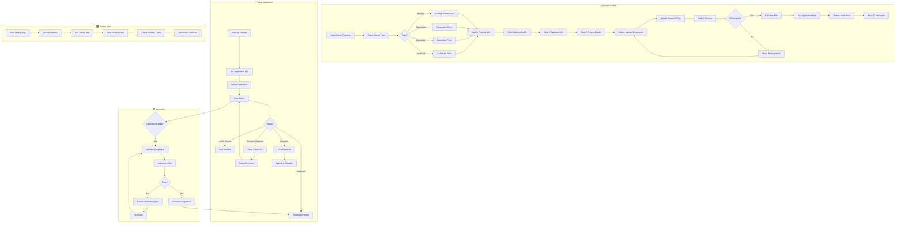

# 2.9 Urban Planning & Permits - Workflow Diagram

## Service Description

Digital permit applications with GIS integration and status tracking.

## User Flow Diagram



## Screens Required

| Screen | Description | Status |
|--------|-------------|--------|
| Permit Types | Selection grid | ✅ Implemented |
| Application Form | Multi-step wizard | ✅ Implemented |
| Document Upload | File attachments | ✅ Implemented |
| My Permits | Application list | ✅ Implemented |
| Permit Details | Status + timeline | ✅ Implemented |
| Zoning Map | Interactive GIS | ✅ Implemented |
| Revision Form | Submit corrections | ✅ Implemented |

## API Endpoints

```text
GET  /api/planning/permit-types
POST /api/planning/applications
GET  /api/planning/applications
GET  /api/planning/applications/{id}
PUT  /api/planning/applications/{id}
POST /api/planning/applications/{id}/documents
GET  /api/planning/applications/{id}/timeline
POST /api/planning/applications/{id}/revision
GET  /api/planning/zoning?lat={lat}&lng={lng}
GET  /api/planning/zoning/certificate?kaek={kaek}
POST /api/planning/applications/{id}/pay
```

## Notifications

| Event | Channel | Message |
|-------|---------|---------|
| Application Received | Push/Email | "Application PRM-2024-001 received" |
| Under Review | Push | "Your application is now under review" |
| Revision Required | Push/Email | "Action needed: Please submit revised documents" |
| Inspection Scheduled | Push/SMS | "Inspection scheduled for Dec 15 at 10 AM" |
| Application Approved | Push/Email | "🎉 Your permit has been approved!" |
| Application Rejected | Email | "Application rejected. See details for reasons." |
