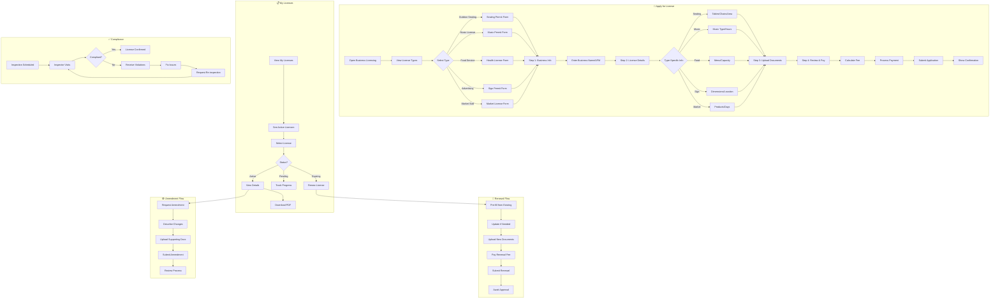

# 2.10 Business Licensing - Workflow Diagram

## Service Description

Digital licensing for outdoor seating, music permits, and trade licenses.

## User Flow Diagram



## Screens Required

| Screen | Description | Status |
|--------|-------------|--------|
| License Types | Selection grid | ✅ Implemented |
| Application Form | Multi-step wizard | ✅ Implemented |
| Business Info | Company details | ✅ Implemented |
| License Details | Type-specific fields | ✅ Implemented |
| Document Upload | Required files | ✅ Implemented |
| My Licenses | Active/pending list | ✅ Implemented |
| License Details | Full info + PDF | ✅ Implemented |
| Renewal Form | Pre-filled renewal | ✅ Implemented |

## API Endpoints

```text
GET  /api/licensing/types
POST /api/licensing/applications
GET  /api/licensing/applications
GET  /api/licensing/applications/{id}
POST /api/licensing/applications/{id}/documents
POST /api/licensing/applications/{id}/pay
GET  /api/licensing/licenses
GET  /api/licensing/licenses/{id}
GET  /api/licensing/licenses/{id}/pdf
POST /api/licensing/licenses/{id}/renew
POST /api/licensing/licenses/{id}/amend
GET  /api/licensing/licenses/expiring
```

## Notifications

| Event | Channel | Message |
|-------|---------|---------|
| Application Received | Push/Email | "License application LIC-2024-001 received" |
| Under Review | Push | "Your application is being reviewed" |
| Approved | Push/Email | "🎉 Your license has been approved!" |
| Expiring Soon | Push/Email | "Your license expires in 30 days. Renew now!" |
| Renewal Reminder | Push | "License renewal due in 7 days" |
| Inspection Scheduled | Push/SMS | "Compliance inspection on Dec 20 at 11 AM" |
