# 2.11 Reports & Complaints - Workflow Diagram

## Service Description

Unified system for citizen reports, complaints, and feedback with tracking.

## User Flow Diagram

```mermaid
flowchart TD
    subgraph Submit["📝 Submit Report"]
        A[Open Reports] --> B[Select Report Type]
        B --> C{Type?}
        C -->|Infrastructure| D[Road/Sidewalk/Lighting]
        C -->|Cleanliness| E[Garbage/Graffiti/Dumping]
        C -->|Safety| F[Hazard/Vandalism]
        C -->|Noise| G[Noise Complaint]
        C -->|Other| H[General Complaint]
        
        D --> I[Select Specific Issue]
        E --> I
        F --> I
        G --> I
        H --> I
        
        I --> J[Add Location]
        J --> K[Use GPS or Map]
        K --> L[Add Description]
        L --> M[Attach Photos/Video]
        M --> N[Set Urgency Level]
        N --> O[Review Report]
        O --> P{Submit?}
        P -->|Yes| Q[Submit Report]
        Q --> R[Show Success Toast]
        R --> S[Display Reference #]
        P -->|No| L
    end

    subgraph Track["📍 Track Report"]
        T[View My Reports] --> U[See Report List]
        U --> V[Filter by Status]
        V --> W[Select Report]
        W --> X[View Details]
        X --> Y[See Status Timeline]
        Y --> Z{Current Status}
        Z -->|Submitted| AA[Awaiting Review]
        Z -->|Assigned| AB[View Department]
        Z -->|In Progress| AC[See Updates]
        Z -->|Resolved| AD[View Resolution]
    end

    subgraph Feedback["💬 Feedback Loop"]
        AD --> AE[Rate Resolution]
        AE --> AF{Satisfied?}
        AF -->|Yes| AG[Submit Positive Rating]
        AG --> AH[Thank You Message]
        AF -->|No| AI[Reopen Report]
        AI --> AJ[Add Comment]
        AJ --> AK[Escalate if Needed]
    end

    subgraph Anonymous["🔒 Anonymous Reports"]
        AL[Report Anonymously] --> AM[Skip Personal Info]
        AM --> AN[Submit Report]
        AN --> AO[Get Tracking Code]
        AO --> AP[Track via Code]
    end

    subgraph Escalation["⬆️ Escalation"]
        AK --> AQ[Auto-escalate]
        AQ --> AR[Notify Supervisor]
        AR --> AS[Priority Review]
        AS --> AT[Expedited Resolution]
    end
```



## Screens Required

| Screen | Description | Status |
|--------|-------------|--------|
| Report Types | Category selection | ✅ Implemented |
| Issue Selection | Specific problems | ✅ Implemented |
| Location Picker | GPS/Map selection | ✅ Implemented |
| Report Form | Description + media | ✅ Implemented |
| My Reports | List with filters | ✅ Implemented |
| Report Details | Full info + timeline | ✅ Implemented |
| Feedback Form | Rating + comments | ✅ Implemented |
| Anonymous Track | Code-based tracking | ⚠️ Basic |

## API Endpoints

```text
GET  /api/reports/categories
GET  /api/reports/categories/{id}/issues
POST /api/reports
GET  /api/reports
GET  /api/reports/{id}
GET  /api/reports/{id}/timeline
POST /api/reports/{id}/comments
POST /api/reports/{id}/feedback
POST /api/reports/{id}/reopen
GET  /api/reports/track/{code}
POST /api/reports/anonymous
```

## Notifications

| Event | Channel | Message |
|-------|---------|---------|
| Report Submitted | Push | "Report #RPT-2024-001 submitted successfully" |
| Report Assigned | Push | "Your report assigned to Maintenance Dept" |
| Status Update | Push | "Update: Work crew dispatched to location" |
| Resolution | Push | "Your reported issue has been resolved" |
| Feedback Request | Push | "How did we do? Rate our response" |
| Escalated | Push | "Your report has been escalated for priority review" |
