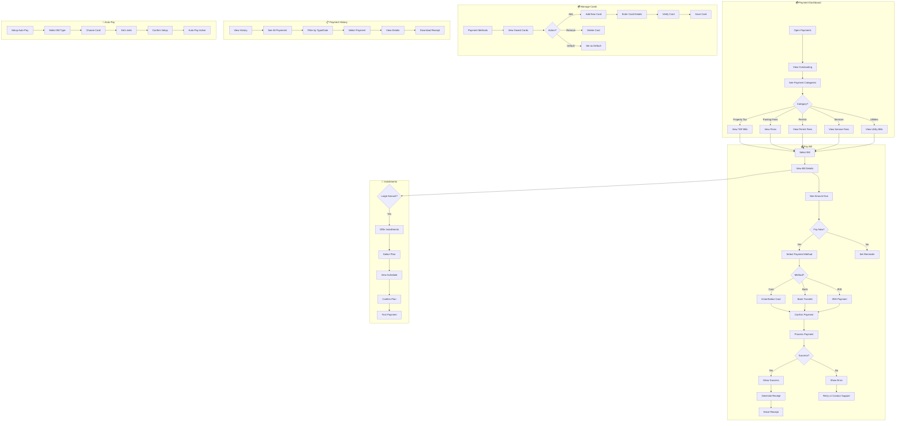

# 2.12 Electronic Payments Gateway - Workflow Diagram

## Service Description

Unified payment platform for all municipal fees, taxes, and services.

## User Flow Diagram



## Screens Required

| Screen | Description | Status |
|--------|-------------|--------|
| Payment Dashboard | Outstanding bills | ✅ Implemented |
| Bill Details | Amount + breakdown | ✅ Implemented |
| Payment Form | Method selection | ✅ Implemented |
| Card Entry | Add new card | ✅ Implemented |
| Payment Success | Confirmation | ✅ Implemented |
| Payment History | Past payments | ✅ Implemented |
| Receipt View | Downloadable PDF | ✅ Implemented |
| Saved Cards | Manage cards | ✅ Implemented |

## API Endpoints

```text
GET  /api/payments/outstanding
GET  /api/payments/bills/{id}
POST /api/payments/process
GET  /api/payments/history
GET  /api/payments/receipts/{id}
GET  /api/payments/methods
POST /api/payments/methods
DELETE /api/payments/methods/{id}
PUT  /api/payments/methods/{id}/default
POST /api/payments/autopay
GET  /api/payments/installments/{billId}
POST /api/payments/installments
```

## Notifications

| Event | Channel | Message |
|-------|---------|---------|
| Payment Success | Push/Email | "Payment of €125.00 successful. Receipt sent." |
| Payment Failed | Push | "Payment failed. Please try again or use different card." |
| Bill Due | Push | "Property tax bill due in 7 days: €450.00" |
| Auto-Pay Processed | Push/Email | "Auto-pay: €35.00 paid for parking permit" |
| Installment Due | Push | "Installment payment due tomorrow: €75.00" |
| New Bill | Push | "New bill available: Parking fine €40.00" |
