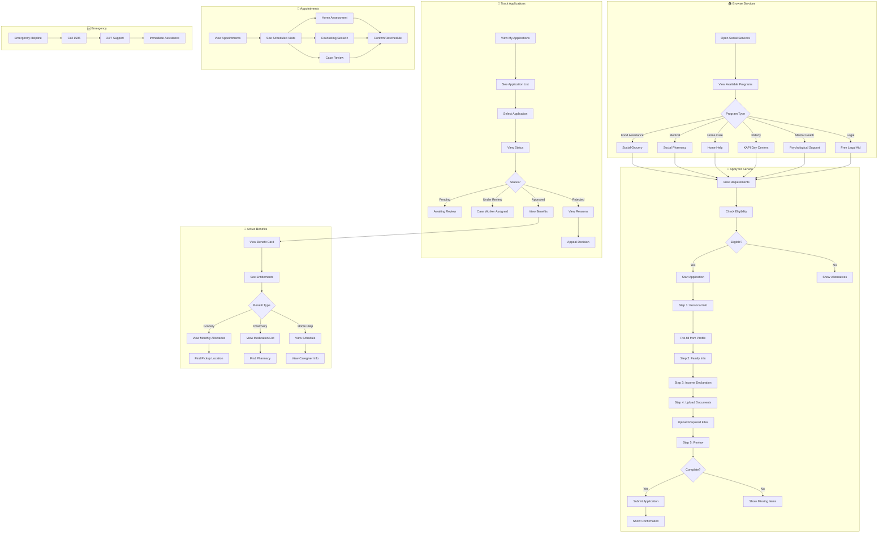

# 2.13 Social Services Suite - Workflow Diagram

## Service Description

Comprehensive social welfare platform with case management and benefits tracking.

## User Flow Diagram



## Screens Required

| Screen | Description | Status |
|--------|-------------|--------|
| Services List | Available programs | ✅ Implemented |
| Service Details | Requirements + info | ✅ Implemented |
| Eligibility Check | Income calculator | ✅ Implemented |
| Application Form | Multi-step wizard | ✅ Implemented |
| Document Upload | Required files | ✅ Implemented |
| My Applications | Status tracking | ✅ Implemented |
| Active Benefits | Current entitlements | ✅ Implemented |
| Appointments | Scheduled visits | ✅ Implemented |
| Emergency Contact | Quick dial | ✅ Implemented |

## API Endpoints

```text
GET  /api/social/services
GET  /api/social/services/{id}
POST /api/social/eligibility/check
POST /api/social/applications
GET  /api/social/applications
GET  /api/social/applications/{id}
POST /api/social/applications/{id}/documents
GET  /api/social/benefits
GET  /api/social/benefits/{id}
GET  /api/social/appointments
POST /api/social/appointments/{id}/reschedule
POST /api/social/applications/{id}/appeal
```

## Notifications

| Event | Channel | Message |
|-------|---------|---------|
| Application Received | Push/SMS | "Application received. Reference: SOC-2024-001" |
| Case Worker Assigned | Push | "Maria P. is your case worker. Contact: 27210-xxxxx" |
| Document Needed | Push/SMS | "Please upload income certificate within 5 days" |
| Application Approved | Push/SMS | "🎉 Your application for Social Grocery approved!" |
| Benefit Ready | Push | "Your monthly grocery allowance is ready for pickup" |
| Appointment Reminder | Push/SMS | "Reminder: Home assessment tomorrow at 10 AM" |
| Renewal Due | Push | "Your benefits expire in 30 days. Renew now." |
