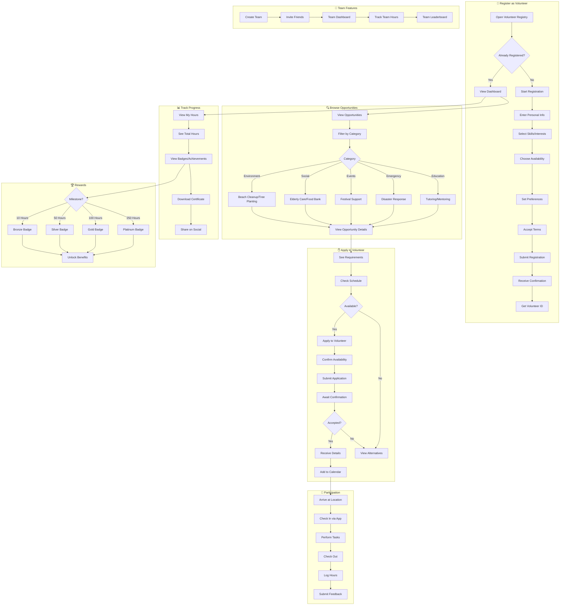

# 2.14 Volunteer Registry - Workflow Diagram

## Service Description

Platform for volunteer registration, opportunity matching, and hours tracking.

## User Flow Diagram



## Screens Required

| Screen | Description | Status |
|--------|-------------|--------|
| Registration Form | Sign up as volunteer | ✅ Implemented |
| Volunteer Dashboard | Overview + stats | ✅ Implemented |
| Opportunities List | Browse activities | ✅ Implemented |
| Opportunity Details | Full info + apply | ✅ Implemented |
| My Activities | Upcoming + past | ✅ Implemented |
| Check In/Out | QR-based attendance | ⚠️ Basic |
| Hours Log | Track volunteer time | ✅ Implemented |
| Achievements | Badges + certificates | ✅ Implemented |

## API Endpoints

```text
POST /api/volunteers/register
GET  /api/volunteers/profile
PUT  /api/volunteers/profile
GET  /api/volunteers/opportunities
GET  /api/volunteers/opportunities/{id}
POST /api/volunteers/opportunities/{id}/apply
GET  /api/volunteers/activities
POST /api/volunteers/activities/{id}/checkin
POST /api/volunteers/activities/{id}/checkout
GET  /api/volunteers/hours
GET  /api/volunteers/achievements
GET  /api/volunteers/certificate
POST /api/volunteers/teams
GET  /api/volunteers/teams/{id}
```

## Notifications

| Event | Channel | Message |
|-------|---------|---------|
| Registration Complete | Push/Email | "Welcome to the Volunteer Registry! ID: VOL-2024-001" |
| New Opportunity | Push | "New opportunity: Beach Cleanup this Saturday" |
| Application Accepted | Push | "You're confirmed for Tree Planting on Dec 15!" |
| Event Reminder | Push | "Reminder: Beach Cleanup tomorrow at 9 AM" |
| Hours Logged | Push | "4 hours logged. Total: 28 hours this year!" |
| Badge Earned | Push | "🏆 Congratulations! You earned the Silver Badge!" |
| Certificate Ready | Push/Email | "Your volunteer certificate is ready to download" |
