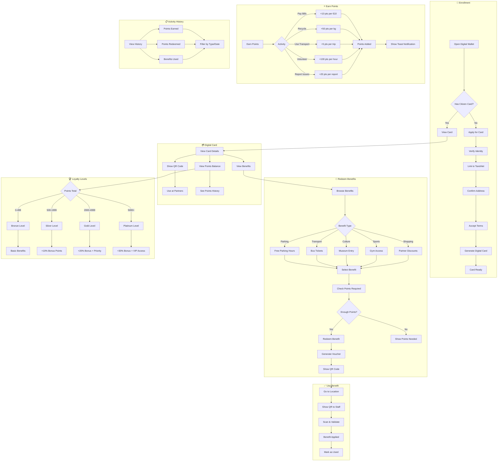

# 2.15 Citizen Card & Loyalty Program - Workflow Diagram

## Service Description

Digital citizen card with loyalty points, benefits, and municipal discounts.

## User Flow Diagram



## Screens Required

| Screen | Description | Status |
|--------|-------------|--------|
| Digital Card | Card display + QR | ✅ Implemented |
| Points Dashboard | Balance + history | ✅ Implemented |
| Benefits Catalog | Available rewards | ✅ Implemented |
| Benefit Details | Requirements + redeem | ✅ Implemented |
| Voucher Display | QR for redemption | ✅ Implemented |
| Activity History | Points transactions | ✅ Implemented |
| Level Progress | Tier status | ✅ Implemented |
| Partner Locations | Where to use | ⚠️ Basic |

## API Endpoints

```text
POST /api/citizen-card/enroll
GET  /api/citizen-card
GET  /api/citizen-card/qr
GET  /api/citizen-card/points
GET  /api/citizen-card/points/history
GET  /api/citizen-card/benefits
GET  /api/citizen-card/benefits/{id}
POST /api/citizen-card/benefits/{id}/redeem
GET  /api/citizen-card/vouchers
GET  /api/citizen-card/vouchers/{id}
POST /api/citizen-card/vouchers/{id}/validate
GET  /api/citizen-card/level
GET  /api/citizen-card/partners
```

## Notifications

| Event | Channel | Message |
|-------|---------|---------|
| Card Activated | Push | "Your Citizen Card is ready! Start earning points." |
| Points Earned | Push | "+50 points for recycling! Balance: 1,250 pts" |
| Level Up | Push | "🎉 Congratulations! You've reached Gold Level!" |
| Benefit Redeemed | Push | "Free parking voucher added to your wallet" |
| Voucher Expiring | Push | "Your museum voucher expires in 3 days" |
| New Benefit | Push | "New benefit available: 20% off at local cafes" |
| Points Expiring | Push | "200 points expire on Dec 31. Redeem now!" |
