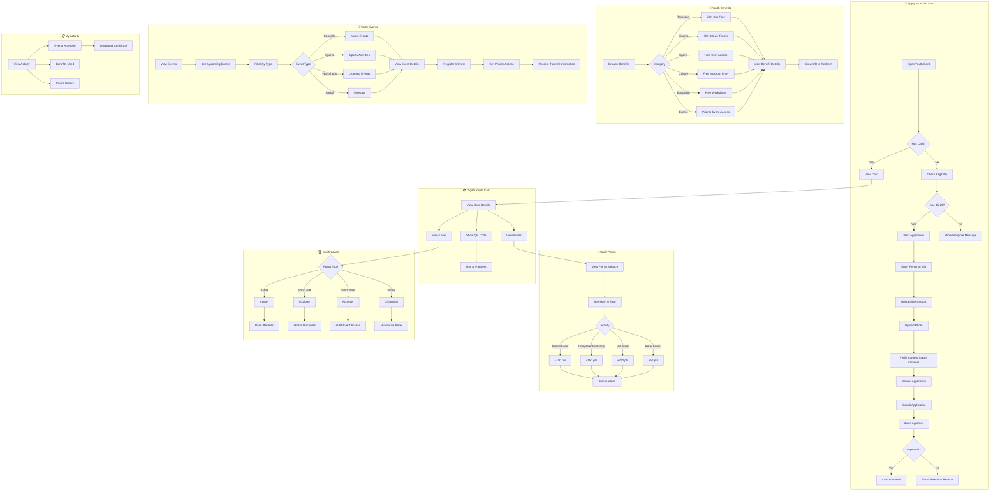

# 2.16 Youth Card - Workflow Diagram

## Service Description

Digital card for citizens aged 15-29 with exclusive discounts and event access.

## User Flow Diagram



## Screens Required

| Screen | Description | Status |
|--------|-------------|--------|
| Application Form | Sign up for card | ✅ Implemented |
| Digital Card | Card display + QR | ✅ Implemented |
| Benefits List | Available discounts | ✅ Implemented |
| Benefit Details | How to use | ✅ Implemented |
| Events List | Upcoming activities | ✅ Implemented |
| Event Details | Info + register | ✅ Implemented |
| Points Dashboard | Balance + history | ✅ Implemented |
| Level Progress | Tier status | ✅ Implemented |

## API Endpoints

```text
POST /api/youth-card/apply
GET  /api/youth-card
GET  /api/youth-card/qr
GET  /api/youth-card/benefits
GET  /api/youth-card/benefits/{id}
GET  /api/youth-card/events
GET  /api/youth-card/events/{id}
POST /api/youth-card/events/{id}/register
GET  /api/youth-card/points
GET  /api/youth-card/points/history
GET  /api/youth-card/level
GET  /api/youth-card/activity
```

## Notifications

| Event | Channel | Message |
|-------|---------|---------|
| Application Received | Push | "Youth Card application received!" |
| Card Approved | Push/SMS | "🎉 Your Youth Card is ready! Start exploring." |
| New Event | Push | "New event: Summer Music Festival - Register now!" |
| Event Reminder | Push | "Reminder: Career Workshop tomorrow at 2 PM" |
| Points Earned | Push | "+100 points for attending Beach Cleanup!" |
| Level Up | Push | "🏆 You've reached Explorer level! New perks unlocked." |
| Birthday | Push | "Happy Birthday! 🎂 Enjoy double points today!" |
| Card Expiring | Push | "Your Youth Card expires in 30 days. Renew now!" |
