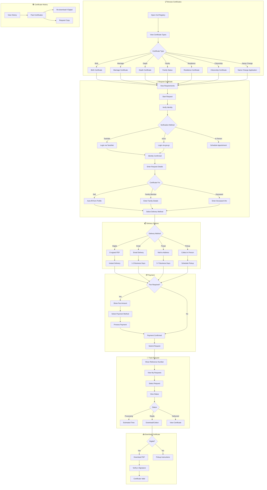

# 2.17 Civil Registry Services - Workflow Diagram

## Service Description

Digital certificate requests with e-signature and electronic delivery.

## User Flow Diagram



## Screens Required

| Screen | Description | Status |
|--------|-------------|--------|
| Certificate Types | Selection grid | ✅ Implemented |
| Certificate Details | Requirements + fees | ✅ Implemented |
| Identity Verification | TaxisNet/eGov login | ✅ Implemented |
| Request Form | Details entry | ✅ Implemented |
| Delivery Selection | Method choice | ✅ Implemented |
| Payment | Fee processing | ✅ Implemented |
| My Requests | Status tracking | ✅ Implemented |
| Certificate View | Download/verify | ✅ Implemented |

## API Endpoints

```text
GET  /api/registry/certificate-types
GET  /api/registry/certificate-types/{id}
POST /api/registry/verify-identity
POST /api/registry/requests
GET  /api/registry/requests
GET  /api/registry/requests/{id}
GET  /api/registry/requests/{id}/status
POST /api/registry/requests/{id}/pay
GET  /api/registry/requests/{id}/download
GET  /api/registry/requests/{id}/verify
GET  /api/registry/history
```

## Notifications

| Event | Channel | Message |
|-------|---------|---------|
| Request Received | Push/Email | "Certificate request REG-2024-001 received" |
| Processing | Push | "Your certificate is being processed" |
| Ready for Download | Push/Email | "Your Birth Certificate is ready! Download now." |
| Ready for Pickup | Push/SMS | "Certificate ready for pickup at City Hall" |
| Shipped | Push/Email | "Your certificate has been mailed. Track: GR123456" |
| Delivered | Push | "Certificate delivered successfully" |
| Verification | Email | "Certificate verification code: ABC123" |
