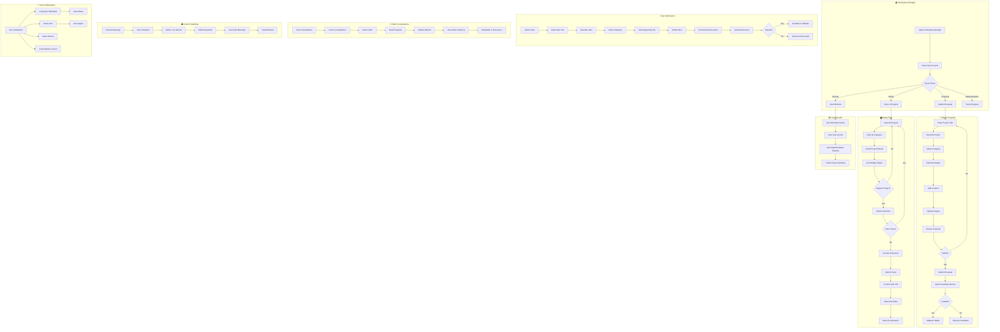

# 2.18 Participatory Budget & Citizen Engagement - Workflow Diagram

## Service Description

Platform for citizen participation in budget allocation and idea submission.

## User Flow Diagram



## Screens Required

| Screen | Description | Status |
|--------|-------------|--------|
| Budget Dashboard | Current cycle info | ✅ Implemented |
| Proposal Form | Submit project | ✅ Implemented |
| Project List | Browse proposals | ✅ Implemented |
| Project Details | Full info + vote | ✅ Implemented |
| Voting Booth | Cast votes | ✅ Implemented |
| Results | Winners + stats | ✅ Implemented |
| Idea Submission | Submit ideas | ✅ Implemented |
| Idea Discussion | Comments + votes | ✅ Implemented |
| Consultations | Public discussions | ⚠️ Basic |
| Council Meetings | Live + archive | ⚠️ Basic |

## API Endpoints

```text
GET  /api/participation/budget/current
GET  /api/participation/budget/projects
POST /api/participation/budget/projects
GET  /api/participation/budget/projects/{id}
POST /api/participation/budget/vote
GET  /api/participation/budget/results
GET  /api/participation/ideas
POST /api/participation/ideas
GET  /api/participation/ideas/{id}
POST /api/participation/ideas/{id}/upvote
POST /api/participation/ideas/{id}/comment
GET  /api/participation/consultations
GET  /api/participation/consultations/{id}
POST /api/participation/consultations/{id}/respond
GET  /api/participation/council/meetings
GET  /api/participation/council/meetings/{id}/stream
```

## Notifications

| Event | Channel | Message |
|-------|---------|---------|
| Voting Open | Push/Email | "Voting is now open! Cast your votes by Dec 31." |
| Proposal Submitted | Push | "Your proposal has been submitted for review" |
| Proposal Approved | Push | "Your proposal is on the ballot! Share it!" |
| Vote Recorded | Push | "Your votes have been recorded. Thank you!" |
| Results Published | Push/Email | "Results are in! See the winning projects." |
| Idea Popular | Push | "Your idea is trending! 50+ upvotes" |
| Consultation Open | Push | "New consultation: City Center Redesign" |
| Council Meeting | Push | "Council meeting starts in 1 hour. Watch live!" |
